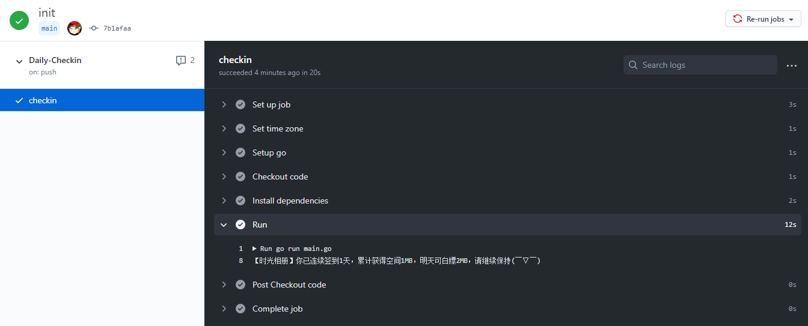
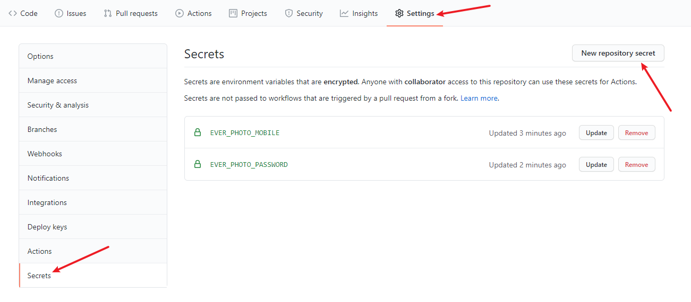
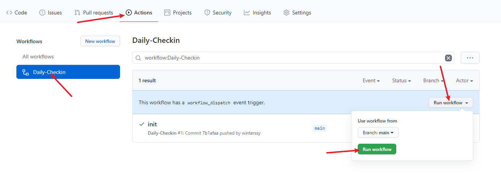

# EverPhotoCheckin

[时光相册](https://web.everphoto.cn) 签到助手，利用GitHub Actions每天自动执行。



## 食用指南

**首先，Fork本项目到自己的仓库。**


**进入刚才Fork的仓库，点击 Settings -> Secrets -> New repository Secrets 添加以下Secrets。**

|         Name          |                     Value                      |
| :-------------------: | :--------------------------------------------: |
|  EVER_PHOTO_MOBILE  | 登录手机号，包括国际区号， 如 `+8613800138000` |
| EVER_PHOTO_PASSWORD |                    登录密码                    |
|  EVER_PHOTO_TOKEN   |             可选，Bearer令牌             |
| SC_KEY | 可选，用于 [Server酱](http://sc.ftqq.com) 推送 |



> 设置了 `EVER_PHOTO_TOKEN` 的条件下无须再设置 `EVER_PHOTO_MOBILE` 和 `EVER_PHOTO_PASSWORD` 。

**切换至Actions选项卡，开启Actions并触发每天自动执行。**



**当然，你也可以自行编译程序并在本地手动执行：**

```sh
$ go get github.com/winterssy/EverPhotoCheckin
$ EverPhotoCheckin -mobile YOUR_MOBILE -password YOUR_PASSWORD
```

## 捐赠支持

如果你觉得本项目对你有帮助，或者单纯想请开发者喝杯咖啡，可使用微信扫描下方的赞赏码。

<div align="center">
	
</div>

